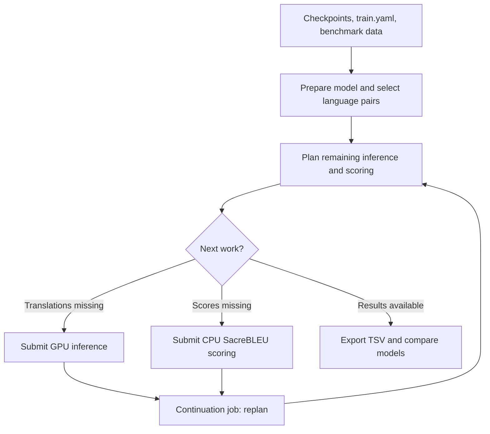

# eval2: Make-driven model evaluation

`eval2` evaluates trained Mammoth translation models. It prepares supervised and zero-shot translation tasks, generates inference configurations, submits SLURM jobs, and summarizes translation quality with BLEU and chrF2.

The **Makefile is the entry point**: you select a model and a target; the helper scripts handle planning and execution. This pipeline evaluates existing checkpoints—it does not train models.

## Directory guide

| Location | Purpose |
| --- | --- |
| `Makefile` | Site configuration, model selection, workflow entry points, and result-analysis targets. |
| [`include/`](include/) | Included Makefile fragments for preparation, pair selection, planning, submission, and continuation. |
| [`bin/`](bin/) | Python and Bash helpers used by the Makefiles. |
| [`template/`](template/) | Templates expanded into model-specific SLURM scripts. |
| [`downloaders/`](downloaders/) | Dataset-download helpers; consult their instructions before preparing benchmark data. |

The files in `include/` are parts of the parent Makefile, not separate workflows to invoke with `make -f`. `mk-model.mk` defines aliases; `mk-basic.mk`, `mk-pairs.mk`, and `mk-calls.mk` prepare the work; `mk-slurm.mk`, `mk-infer.mk`, `mk-score.mk`, and `mk-contr.mk` manage execution.

## Inputs and assumptions

For each model, the pipeline reads:

- its Mammoth checkpoints and `train.yaml`;
- selected supervised and zero-shot language-pair lists;
- benchmark source/reference files under `DATADIR`; and
- existing hypotheses and scores when planning remaining work.

The planner supports **Flores+, BOUQuET, BOUQuET-par, and WMT24++** using fixed directory and filename conventions. Dataset combinations without the expected source/reference files are skipped. Obtaining and preparing benchmark data is a separate step; running evaluation does not automatically download it.

The current setup targets **CSC/LUMI**. Before using it, review the configuration at the top of `Makefile` and the aliases in `include/mk-model.mk`. In particular, set the project accounts, `SELFDIR`, model paths, `TESTINGDIR`/`DATADIR`, Mammoth installations, virtual environments, and Singularity image.

Execution assumes GNU Make, Bash, SLURM, environment modules (`cray-python`), Singularity, and compatible Python environments. Planning uses PyYAML and NetworkX, checkpoint inspection uses PyTorch, and scoring uses SacreBLEU. lang2vec provides optional linguistic-distance information for zero-shot ranking. The Makefile does not install every dependency. Use only trusted checkpoints: preparation currently invokes the inspector with `--unsafe`.

## Workflow



This diagram shows the core inference/SacreBLEU path. The continuation controller also contains hooks for COMET and visualization, which are not complete (see below).

Planning creates task-specific YAML files and shell call lists. SLURM scripts are generated from templates, resource requests are calculated from those lists, and jobs execute the planned commands. Later planning passes use existing outputs to decide what remains: a hypothesis with the expected line count is treated as ready for scoring. This is a practical restart heuristic, not a full correctness check.

## Example usage

Run from `make/eval2`, with initial preparation outside a SLURM allocation. Replace `docmt4denhalfbase` with an alias shown by `make list`. **The model alias must be the first goal.**

```bash
make help
make list

# Prepare directories, inspect checkpoints, and select Mammoth.
make docmt4denhalfbase mk-basic

# Generate pair proposals, then review the selections (see note below).
make docmt4denhalfbase mk-pairs

# Generate task configurations and command lists.
make docmt4denhalfbase mk-calls

# Submit inference, followed by a continuation job.
make docmt4denhalfbase mk-infer-score

# Inspect progress, or replan and resume an interrupted workflow.
make status
make docmt4denhalfbase continue-eval
```

Pair proposals are named `inf_supervised.txt.input` and `inf_zeroshot.txt.input` in the model directory. Review them and save the desired pairs as `inf_supervised.txt` and `inf_zeroshot.txt`. `mk-pairs-force` accepts proposals automatically and can replace manual selections. **The supplied version has a pair-generation integration defect; see Development status before the first run.**

To submit stages separately, use `mk-infer` or `mk-score`. An unlisted model can be addressed with `make MODELDIR=/path/to/model mk-basic`; registered aliases are preferable for the current continuation machinery.

Once scores exist:

```bash
make docmt4denhalfbase mt-bleu
make docmt4denhalfbase mt-chrf
make sacre-tsv-all
make compare list-groups
make compare COMPARE_GROUP=model-size COMPARE_DATASET=bqtpar
```

The shown summary/export targets select the `mt` task family. For `sentmt` or `docmt` exports, use the corresponding `--kind` option of `bin/summarize_sacre.py`. Comparisons use tasks shared by the selected models, preserving localized identifiers such as `CA.fra` and `FR.fra`.

## Outputs and monitoring

Results are stored beside the model, not in this source directory:

| Model-local path | Contents |
| --- | --- |
| `model-summary.yaml`, `mammoth.selected` | Checkpoint summary and selected Mammoth installation. |
| `inf_out/` | Inference YAMLs, call lists, generated job scripts, and translation hypotheses. |
| `inf_logs/` | Job and inference logs. |
| `inf_scores/` | Individual metric results. |
| `eval3/sacre.tsv` | Score export created by `sacre-tsv-all`. |

`*.submitted` files record job IDs. `*.done` files record script termination, **not necessarily success**. Continuations use `afterany`, so they may run after failed jobs too. Check logs and SLURM exit status rather than treating `DONE` as proof of a successful evaluation. `make status` also removes inference submission markers when their jobs are no longer visible in the queue.

## Development status

This is a site-specific research workflow under active development, not a turnkey evaluation package. The following describes the supplied source; it is not an end-to-end validation on a live cluster.

| Area | Status |
| --- | --- |
| Preparation, planning, inference, and BLEU/chrF2 scoring | Implemented core path, with integration issues still to resolve. |
| Score summaries, TSV export, and comparisons | Implemented; comparisons require compatible task families and available common scores. |
| Automatic continuation | Implemented for inference/scoring, but unfinished later stages and lock handling need attention. |
| COMET | Commands are generated, but `mk-comet` is only a placeholder. |
| Visualization | Referenced by continuation as `mk-viz`, but no implementation appears in the supplied Makefiles. |
| Portability and tests | Site assumptions remain embedded; no automated test suite was supplied. |

Before unattended runs, resolve the main integration issues:

- `mk-pairs.mk` passes `--zs-out` together with `--supervised-pairs-and-quit`; the script exits after supervised export without writing zero-shot proposals.
- Templates and Make prerequisites disagree about the location of `slurm_distr.sh`. Also, each rank currently shuffles independently, which can duplicate or omit work; ranks need a common command ordering.
- Some force-target recipes and lock operations need correction. The wrapper can also mask a distributor failure because it does not propagate that exit status reliably.

See [`bin/MAINTAINERS.md`](bin/MAINTAINERS.md) for detailed interfaces and testing guidance. On another cluster, also adapt partitions, resource tables, container bindings, network settings, and benchmark layouts. Keep changes to the Makefiles, helpers, and templates coordinated.
